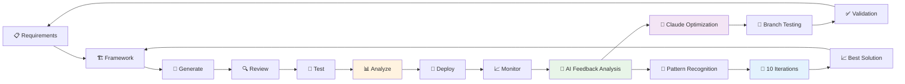

# CodeMetrics - AI-Powered Development Analytics 📊

[](https://github.com/Jita81/CODEMETRICS/actions)
[](https://opensource.org/licenses/MIT)
[](https://www.python.org/downloads/)
[](https://www.anthropic.com/)

## 📊 **Part of the Automated Agile Framework Ecosystem**

**CodeMetrics** is the **analytics and optimization engine** in a comprehensive suite of AI-powered development tools:

| Component | Purpose | Repository | Status |
|-----------|---------|------------|--------|
| 🏗️ **[Standardized Modules Framework](https://github.com/Jita81/Standardized-Modules-Framework-v1.0.0)** | AI-optimized scaffolding & structure | `Jita81/Standardized-Modules-Framework-v1.0.0` | ✅ Active |
| 🔍 **[CodeReview](https://github.com/Jita81/CODEREVIEW)** | AI-powered code analysis & security | `Jita81/CODEREVIEW` | ✅ Active |
| 🤖 **[CodeCreate](https://github.com/Jita81/CODECREATE)** | AI-driven module generation | `Jita81/CODECREATE` | ✅ Active |
| 🧪 **[CodeTest](https://github.com/Jita81/CODETEST)** | Framework compliance & testing | `Jita81/CODETEST` | ✅ Active |
| 📊 **CodeMetrics** | AI-powered analytics & insights | `Jita81/CODEMETRICS` | 🚀 **This Repository** |

### 🔄 **Complete Development Intelligence**

1. **🏗️ Scaffold** → Generate structure with [Standardized Modules Framework](https://github.com/Jita81/Standardized-Modules-Framework-v1.0.0)
2. **🤖 Generate** → Create code with [CodeCreate](https://github.com/Jita81/CODECREATE) (Claude 4)
3. **🔍 Review** → Validate quality with [CodeReview](https://github.com/Jita81/CODEREVIEW)
4. **🧪 Test** → Ensure compliance with [CodeTest](https://github.com/Jita81/CODETEST) (Framework validation)
5. **📊 Analyze** → **Optimize performance with CodeMetrics** (AI-driven insights)
6. **🚀 Deploy** → Ship with continuous optimization

---

## 🚀 **CodeMetrics Overview**

An intelligent analytics platform that provides AI-powered insights into development performance, code quality trends, and optimization opportunities across the entire Automated Agile Framework ecosystem.

## 🎯 **Key Features**

### 📈 **Performance Analytics**
* **Real-time Monitoring**: Track module performance across environments
* **Trend Analysis**: Identify quality and performance patterns over time
* **Predictive Insights**: AI-powered recommendations for optimization
* **Cross-Service Dependencies**: Map interactions between framework components

### 🤖 **AI-Driven Optimization**
* **Claude 4 Analysis**: Deep performance analysis with advanced AI capabilities
* **Pattern Recognition**: Identify inefficiencies and optimization opportunities
* **Automated Recommendations**: Actionable insights for improvement
* **Business Impact Correlation**: Connect technical metrics to business outcomes

### 🧠 **Intelligent Ecosystem Optimization** ⭐ **NEW**
* **Feedback Loop Analysis**: AI analyzes bugs and issues from Generate, Review, Test processes
* **Automated Branch Testing**: Creates optimization branches and tests changes automatically
* **10-Iteration Strategy**: Tests multiple optimization approaches to find the best solution
* **Cross-Component Intelligence**: Optimizes Framework, CodeCreate, CodeReview, and CodeTest
* **Claude-Powered Insights**: Uses advanced AI to identify root causes and solutions

### 🔗 **Ecosystem Integration**
* **Framework Analytics**: Track scaffolding efficiency and patterns
* **Generation Metrics**: Monitor [CodeCreate](https://github.com/Jita81/CODECREATE) output quality
* **Review Correlation**: Analyze [CodeReview](https://github.com/Jita81/CODEREVIEW) findings trends
* **Testing Analytics**: Track [CodeTest](https://github.com/Jita81/CODETEST) compliance and validation
* **Continuous Feedback**: Close the loop with actionable insights

## 📊 **Analytics Dashboard**

### 🎯 **Development Velocity**
- **Time to Module**: Track generation speed improvements
- **Quality Scores**: Monitor consistency across teams
- **Deployment Success**: Measure production reliability
- **Developer Productivity**: Quantify efficiency gains

### 🔍 **Quality Trends**
- **Security Patterns**: Track vulnerability detection rates
- **Performance Regression**: Identify performance degradation
- **Code Complexity**: Monitor maintainability trends
- **Test Coverage**: Ensure quality consistency

### 🏗️ **Architecture Insights**
- **Module Dependencies**: Visualize service interactions
- **Resource Utilization**: Optimize infrastructure costs
- **Scaling Patterns**: Predict capacity needs
- **Integration Health**: Monitor ecosystem connectivity

## 🔄 **Intelligent Ecosystem Optimization Loop**



## 🚀 **Quick Start**

### 📦 **Installation**

```bash
# Clone the repository
git clone https://github.com/Jita81/CODEMETRICS.git
cd CODEMETRICS

# Set up Python environment
python3 -m venv venv
source venv/bin/activate  # On Windows: venv\Scripts\activate

# Install dependencies
pip install -r requirements.txt
```

### ⚙️ **Configuration**

```bash
# Set up your API keys
export ANTHROPIC_API_KEY="your-anthropic-api-key"
export GITHUB_TOKEN="your-github-token"

# Configure analytics settings
cp config/example-config.yml config/config.yml
# Edit config/config.yml with your settings
```

### 🏃 **Running Analytics**

```bash
# Start the analytics engine
python -m codemetrics analyze --project /path/to/your/project

# Run web dashboard
python -m codemetrics dashboard --port 8080

# Generate reports
python -m codemetrics report --format html --output reports/

# 🧠 NEW: Run intelligent optimization with Claude
python -m codemetrics optimize --iterations 10

# Analyze ecosystem feedback patterns
python -m codemetrics feedback-analysis --pattern-analysis
```

## 🧠 **Intelligent Ecosystem Optimization**

### 🔄 **How It Works**

CodeMetrics now includes an **AI-powered optimization engine** that continuously improves your entire development ecosystem:

#### 1. **🔍 Feedback Analysis**
- Monitors bugs, failures, and performance issues across all components
- Analyzes patterns in CodeCreate generations, CodeReview findings, and CodeTest results
- Uses Claude to identify root causes and optimization opportunities

#### 2. **🎯 Pattern Recognition** 
- Identifies recurring issues: "Token timeouts in CodeCreate", "False positives in CodeReview"
- Calculates impact scores and frequencies to prioritize optimizations
- Suggests specific optimization strategies with confidence ratings

#### 3. **🌿 Automated Branch Testing**
```bash
# For each optimization opportunity, the system:
git checkout -b ai-optimize-codecreate-1-1674567890
# Apply Claude-generated improvements
git commit -m "AI Optimization: Reduce token timeouts"
# Run comprehensive tests
# Measure performance improvements
```

#### 4. **🔄 10-Iteration Strategy**
- Tests up to 10 different optimization approaches
- Compares results: performance gains, quality scores, test success rates
- Identifies the most successful optimization strategies

#### 5. **📊 Results & Recommendations**
```bash
🚀 Optimization Complete!
📈 Identified 3 successful optimizations
🎯 Average success score: 0.87

📊 Optimization Summary:
  • CodeCreate: Token efficiency +22%
  • CodeReview: False positives -18% 
  • CodeTest: Build time -28%
```

### 🎯 **Optimization Examples**

#### **CodeCreate Optimizations**
- **Token Efficiency**: Reduce Claude 4 token usage while maintaining quality
- **Generation Speed**: Optimize prompt structures for faster responses
- **Quality Consistency**: Improve generation reliability across module types

#### **CodeReview Optimizations** 
- **False Positive Reduction**: Fine-tune analysis rules to reduce developer friction
- **Performance Improvements**: Optimize analysis speed for large codebases
- **Security Detection**: Enhance vulnerability detection accuracy

#### **CodeTest Optimizations**
- **Build Performance**: Optimize Docker build caching and parallelization
- **Test Reliability**: Reduce flaky tests and improve consistency
- **Compliance Accuracy**: Enhance framework validation rules

#### **Framework Optimizations**
- **Template Completeness**: Identify and fill gaps in module templates
- **Scaffold Efficiency**: Optimize generation speed and resource usage
- **Documentation Quality**: Improve template documentation and examples

### 🚀 **Usage**

```bash
# Run full ecosystem optimization
python -m codemetrics optimize --iterations 10

# Target specific components
python -m codemetrics optimize --components codecreate,codereview --iterations 5

# Analyze feedback patterns without optimization
python -m codemetrics feedback-analysis --pattern-analysis

# Generate optimization report
python -m codemetrics optimize --output optimization-report.md
```

### 📊 **Success Metrics**

The optimization engine tracks multiple success criteria:

| Metric | Weight | Description |
|--------|---------|-------------|
| **Performance Improvement** | 40% | Measurable speed/efficiency gains |
| **Quality Score** | 30% | Code quality and reliability improvements |
| **Test Success Rate** | 20% | Validation and testing improvements |
| **Pattern Confidence** | 10% | AI confidence in the optimization |

**Success Threshold**: Optimizations with combined score > 0.7 are recommended for implementation.

## 📈 **Integration with Ecosystem**

### 🔗 **Data Collection Points**

```yaml
data_sources:
  standardized_framework:
    - module_generation_metrics
    - template_usage_patterns
    - scaffolding_efficiency
    
  codecreate:
    - generation_time_metrics
    - token_utilization_tracking
    - output_quality_scores
    
  codereview:
    - quality_assessment_results
    - security_finding_trends
    - review_consistency_metrics
    
  codetest:
    - framework_compliance_metrics
    - testing_coverage_analysis
    - validation_performance_data
```

### 📊 **Analytics Pipeline**

```yaml
pipeline:
  collection:
    - real_time_metrics: "Streaming data ingestion"
    - batch_processing: "Historical analysis"
    - api_integration: "REST endpoints for all tools"
    
  analysis:
    - claude_4_insights: "AI-powered pattern recognition"
    - trend_analysis: "Time-series performance tracking"
    - correlation_engine: "Cross-metric relationship analysis"
    
  visualization:
    - real_time_dashboards: "Live performance monitoring"
    - executive_reports: "Business impact summaries"
    - developer_insights: "Actionable optimization recommendations"
```

## 🎯 **Performance Metrics**

### 🏆 **Expected Performance Improvements**

| Metric | Before Framework | With Ecosystem | CodeMetrics Enhancement |
|--------|------------------|----------------|------------------------|
| **Development Speed** | 3-5 days | 5 minutes | **Real-time optimization** |
| **Quality Consistency** | 60-70% | 85%+ | **Trend monitoring** |
| **Security Detection** | Manual | 365% rate | **Pattern recognition** |
| **Performance Optimization** | Reactive | Proactive | **Predictive analytics** |

### 📈 **Development Performance**

```yaml
metrics:
  velocity:
    - time_to_module: "< 5 minutes target"
    - quality_score: "85%+ consistency"
    - deployment_success: "98%+ reliability"
    
  efficiency:
    - token_utilization: "38% savings vs traditional"
    - code_reuse: "Framework pattern adoption"
    - developer_productivity: "10x improvement tracking"
```

### 🔍 **Quality Intelligence**

```yaml
quality_trends:
  security:
    - vulnerability_detection_rate: "365% vs manual"
    - compliance_score: "GDPR, SOC2, HIPAA tracking"
    - threat_pattern_recognition: "AI-powered analysis"
    
  performance:
    - response_time_trends: "< 200ms target monitoring"
    - resource_optimization: "Cost vs performance analysis"
    - scaling_prediction: "Capacity planning insights"
```

## 🛠️ **Architecture**

### 🏗️ **Core Components**

```python
codemetrics/
├── collector/          # Data collection from ecosystem
├── analyzer/          # AI-powered analysis engine
├── dashboard/         # Web-based visualization
├── integrations/      # Ecosystem tool integrations
└── reports/          # Report generation
```

### 🔌 **Integrations**

- **🏗️ Framework Integration**: Scaffolding metrics collection
- **🤖 CodeCreate Integration**: Generation performance tracking
- **🔍 CodeReview Integration**: Quality correlation analysis
- **📊 Custom Metrics**: Extensible analytics framework

## 🌟 **Ecosystem Benefits**

### 📈 **Complete Development Intelligence**

CodeMetrics completes the Automated Agile Framework by providing:

- **End-to-End Visibility**: See the entire development pipeline
- **Optimization Opportunities**: AI-identified improvement areas
- **Quality Trends**: Long-term code health monitoring
- **Business Alignment**: Connect technical metrics to business goals

### 🔄 **Continuous Improvement Loop**

The analytics platform enables:
- **Data-Driven Decisions**: Metrics-based development choices
- **Predictive Optimization**: Prevent issues before they occur
- **Performance Correlation**: Link code quality to business outcomes
- **Team Productivity**: Quantify and optimize developer efficiency

## 🤝 **Contributing**

We welcome contributions to enhance CodeMetrics:

1. **Fork the repository**
2. **Create a feature branch**: `git checkout -b feature/amazing-analytics`
3. **Commit your changes**: `git commit -m 'Add amazing analytics feature'`
4. **Push to the branch**: `git push origin feature/amazing-analytics`
5. **Open a Pull Request**

### 🛠️ **Development Setup**

```bash
# Clone and setup development environment
git clone https://github.com/Jita81/CODEMETRICS.git
cd CODEMETRICS

# Install development dependencies
pip install -r requirements-dev.txt

# Run tests
pytest tests/

# Run linting
flake8 src/
black src/
```

## 📞 **Support & Community**

### 🔗 **Ecosystem Links**
* 🏗️ **Framework**: [Standardized-Modules-Framework](https://github.com/Jita81/Standardized-Modules-Framework-v1.0.0)
* 🔍 **Review**: [CodeReview](https://github.com/Jita81/CODEREVIEW)
* 🤖 **Generation**: [CodeCreate](https://github.com/Jita81/CODECREATE)
* 🧪 **Testing**: [CodeTest](https://github.com/Jita81/CODETEST)
* 📊 **Analytics**: [CodeMetrics](https://github.com/Jita81/CODEMETRICS) (this repository)

### 📧 **Support Channels**
* 🐛 [Report Issues](https://github.com/Jita81/CODEMETRICS/issues)
* 💬 [Discussions](https://github.com/Jita81/CODEMETRICS/discussions)
* 📧 **Enterprise Analytics**: Contact for business intelligence solutions

## 🙏 **Acknowledgments**

### 🤖 **Ecosystem Partners**
* **[Standardized Modules Framework](https://github.com/Jita81/Standardized-Modules-Framework-v1.0.0)**: Foundation for consistent analytics
* **[CodeCreate](https://github.com/Jita81/CODECREATE)**: Generation metrics and quality tracking
* **[CodeReview](https://github.com/Jita81/CODEREVIEW)**: Quality correlation and trend analysis
* **[CodeTest](https://github.com/Jita81/CODETEST)**: Framework compliance and testing validation

### 📊 **Analytics Foundation**
* **Claude 4**: AI-powered performance analysis and insights
* **Real-time Processing**: Stream analytics for immediate feedback
* **Business Intelligence**: Enterprise-grade reporting and visualization
* **Community Driven**: Built with feedback from developers and teams

## 📄 **License**

This project is licensed under the MIT License - see the [LICENSE](LICENSE) file for details.

---

**📊 Complete your development intelligence with AI-powered analytics and optimization!**

*Built with ❤️ by the Automated Agile Framework Team*
