# Ecosystem Intelligence Loop Guide

## Overview

The **Ecosystem Intelligence Loop** is an advanced AI-powered system that continuously monitors feedback from the Automated Agile Framework ecosystem (CodeCreate, CodeReview, CodeTest) and automatically identifies, tests, and recommends improvements.

## How It Works

```mermaid
graph TD
    A[🔍 Collect Feedback] --> B[🧠 Analyze Patterns]
    B --> C[💡 Generate Improvements]
    C --> D[🌿 Create Test Branches]
    D --> E[🧪 Run Iterations]
    E --> F[📊 Evaluate Results]
    F --> G[🏆 Select Best]
    G --> H[📋 Generate Report]
    
    H --> I{Continue?}
    I -->|Yes| A
    I -->|No| J[✅ Complete]
    
    style A fill:#e3f2fd
    style B fill:#fff3e0
    style G fill:#e8f5e8
```



## Key Features

### 🔍 Feedback Analysis
- **Multi-Source Collection**: Gathers data from CodeCreate, CodeReview, and CodeTest
- **Pattern Recognition**: Uses Claude to identify recurring issues and root causes
- **Severity Assessment**: Classifies feedback by impact and frequency

### 🧠 AI-Powered Improvements
- **Root Cause Analysis**: Identifies underlying issues across processes
- **Improvement Generation**: Creates specific, actionable code changes
- **Confidence Scoring**: Rates the likelihood of success for each improvement

### 🧪 Iterative Testing
- **Automated Branching**: Creates isolated test environments
- **Multiple Iterations**: Tests up to 10 different improvement approaches
- **Performance Metrics**: Measures impact on quality, security, and performance

### 🏆 Smart Selection
- **Success Scoring**: Evaluates improvements based on multiple criteria
- **Risk Assessment**: Considers potential negative impacts
- **Best Practice Recommendations**: Suggests implementation strategies

## Getting Started

### Prerequisites

1. **Environment Setup**:
   ```bash
   export ANTHROPIC_API_KEY="your-anthropic-api-key"
   export GITHUB_TOKEN="your-github-token"  # Optional
   ```

2. **Dependencies**:
   ```bash
   pip install anthropic GitPython click pyyaml
   ```

### Basic Usage

#### Command Line Interface

```bash
# Run intelligence loop on current directory
python -m codemetrics intelligence-loop

# Specify target repository and iteration count
python -m codemetrics intelligence-loop --repo-path /path/to/project --iterations 5

# Save results to file
python -m codemetrics intelligence-loop --output intelligence_results.json
```

#### Python API

```python
import asyncio
from codemetrics.config import Config
from codemetrics.intelligence_loop import EcosystemIntelligenceLoop

async def run_intelligence_loop():
    # Load configuration
    config = Config.load()
    
    # Create intelligence loop
    intelligence = EcosystemIntelligenceLoop(config)
    
    # Configure settings
    intelligence.max_iterations = 10
    intelligence.analysis_window_days = 30
    
    # Run the loop
    results = await intelligence.run_intelligence_loop("/path/to/repository")
    
    # Process results
    report = results["intelligence_loop_report"]
    print(f"Found {len(report['best_improvements'])} improvements")

# Run the async function
asyncio.run(run_intelligence_loop())
```

## Configuration Options

### Intelligence Loop Settings

```yaml
# config/config.yml
intelligence_loop:
  max_iterations: 10              # Maximum improvement iterations to test
  analysis_window_days: 30        # Feedback analysis timeframe
  min_feedback_frequency: 3       # Minimum issue frequency to consider
  
anthropic:
  model: "claude-3-5-sonnet-20241022"
  max_tokens: 8192
  temperature: 0.3
  
ecosystem:
  repos:
    - "Jita81/CODECREATE"
    - "Jita81/CODEREVIEW"
    - "Jita81/CODETEST"
    - "Jita81/Standardized-Modules-Framework-v1.0.0"
```

## Understanding Results

### Feedback Analysis

The intelligence loop analyzes feedback from three main sources:

1. **CodeCreate Feedback**:
   - Generation success rates
   - Quality issues in generated code
   - Token utilization efficiency
   - Common generation patterns

2. **CodeReview Feedback**:
   - Security detection rates
   - Quality assessment accuracy
   - Compliance scoring
   - Vulnerability trends

3. **CodeTest Feedback**:
   - Framework compliance rates
   - Test success rates by module type
   - Performance metrics
   - Infrastructure testing results

### Improvement Candidates

Each improvement candidate includes:

```json
{
  "process_type": "generate|review|test|framework",
  "improvement_type": "bug_fix|performance|reliability|accuracy|feature",
  "description": "Detailed description of the improvement",
  "confidence_score": 0.85,
  "expected_impact": "high|medium|low",
  "risk_level": "high|medium|low",
  "target_files": ["file1.py", "file2.py"],
  "code_changes": [
    {
      "file": "path/to/file.py",
      "change_type": "modify|add|delete",
      "description": "What this change does",
      "code": "Actual code implementation"
    }
  ]
}
```

### Success Metrics

Each iteration is evaluated based on:

- **Test Pass Rate**: Percentage of tests that pass after changes
- **Errors Fixed**: Number of existing issues resolved
- **New Errors**: Number of new issues introduced
- **Performance Impact**: Changes in execution time and resource usage
- **Overall Success Score**: Weighted combination of all factors

## Best Practices

### 1. Regular Execution
- Run the intelligence loop weekly or after major changes
- Monitor trends in improvement suggestions
- Track the success rate of implemented improvements

### 2. Gradual Implementation
- Start with low-risk, high-confidence improvements
- Test improvements in staging environments first
- Implement successful changes incrementally

### 3. Feedback Loop
- Monitor the impact of implemented improvements
- Adjust configuration based on results
- Provide feedback to improve AI suggestions

### 4. Integration with CI/CD
```yaml
# .github/workflows/intelligence-loop.yml
name: Ecosystem Intelligence Loop
on:
  schedule:
    - cron: '0 0 * * 1'  # Weekly on Monday
  workflow_dispatch:

jobs:
  intelligence:
    runs-on: ubuntu-latest
    steps:
    - uses: actions/checkout@v4
    - name: Setup Python
      uses: actions/setup-python@v4
      with:
        python-version: '3.11'
    - name: Install dependencies
      run: pip install -r requirements.txt
    - name: Run Intelligence Loop
      env:
        ANTHROPIC_API_KEY: ${{ secrets.ANTHROPIC_API_KEY }}
        GITHUB_TOKEN: ${{ secrets.GITHUB_TOKEN }}
      run: python -m codemetrics intelligence-loop --output intelligence_results.json
    - name: Upload Results
      uses: actions/upload-artifact@v3
      with:
        name: intelligence-results
        path: intelligence_results.json
```

## Advanced Usage

### Custom Feedback Sources

```python
from codemetrics.intelligence_loop import FeedbackItem, ProcessType, FeedbackSeverity

# Add custom feedback
custom_feedback = FeedbackItem(
    id="custom-issue-1",
    process_type=ProcessType.GENERATE,
    severity=FeedbackSeverity.HIGH,
    description="Custom issue detected",
    error_details="Detailed error information",
    frequency=5,
    first_seen=datetime.now() - timedelta(days=7),
    last_seen=datetime.now(),
    affected_modules=["custom_module"]
)

intelligence_loop.feedback_history.append(custom_feedback)
```

### Custom Improvement Logic

```python
# Override improvement generation
async def custom_improvement_generator(self, priority, feedback_analysis):
    # Custom logic for generating improvements
    candidates = []
    
    # Add your custom improvement logic here
    
    return candidates

# Replace the method
intelligence_loop._generate_improvement_candidates = custom_improvement_generator
```

## Troubleshooting

### Common Issues

1. **API Key Issues**:
   ```
   ❌ ANTHROPIC_API_KEY is required
   ```
   **Solution**: Set the environment variable or add to config file

2. **Git Repository Issues**:
   ```
   ❌ Not a git repository
   ```
   **Solution**: Run in a git repository or initialize with `git init`

3. **Branch Creation Failures**:
   ```
   ❌ Failed to create branch
   ```
   **Solution**: Ensure working directory is clean and you have write permissions

4. **Test Execution Failures**:
   ```
   ❌ Tests timed out
   ```
   **Solution**: Increase timeout or ensure test environment is properly configured

### Debug Mode

Enable verbose logging:

```python
import logging
logging.basicConfig(level=logging.DEBUG)

# Run intelligence loop with debug info
results = await intelligence.run_intelligence_loop(repo_path)
```

## Monitoring and Metrics

### Key Performance Indicators

- **Improvement Success Rate**: Percentage of suggestions that improve metrics
- **Time to Improvement**: How quickly issues are identified and resolved
- **Ecosystem Health Score**: Overall health across all processes
- **Feedback Response Time**: How quickly the system responds to new issues

### Dashboard Integration

The intelligence loop integrates with the CodeMetrics dashboard to provide:

- Real-time feedback monitoring
- Improvement suggestion tracking
- Success rate visualization
- Historical trend analysis

## Contributing

To contribute to the intelligence loop:

1. **Feedback Analyzers**: Add new sources of feedback analysis
2. **Improvement Generators**: Create specialized improvement logic
3. **Test Evaluators**: Enhance success measurement criteria
4. **Integration Connectors**: Add support for additional tools

## Support

For issues or questions:

- 📧 **Documentation**: Check the examples in `/examples/`
- 🐛 **Bug Reports**: Open an issue with reproduction steps
- 💡 **Feature Requests**: Describe your use case and requirements
- 🤝 **Community**: Join discussions for best practices

---

**The Ecosystem Intelligence Loop represents the cutting edge of AI-powered development optimization, providing continuous learning and improvement for your entire development workflow.**
